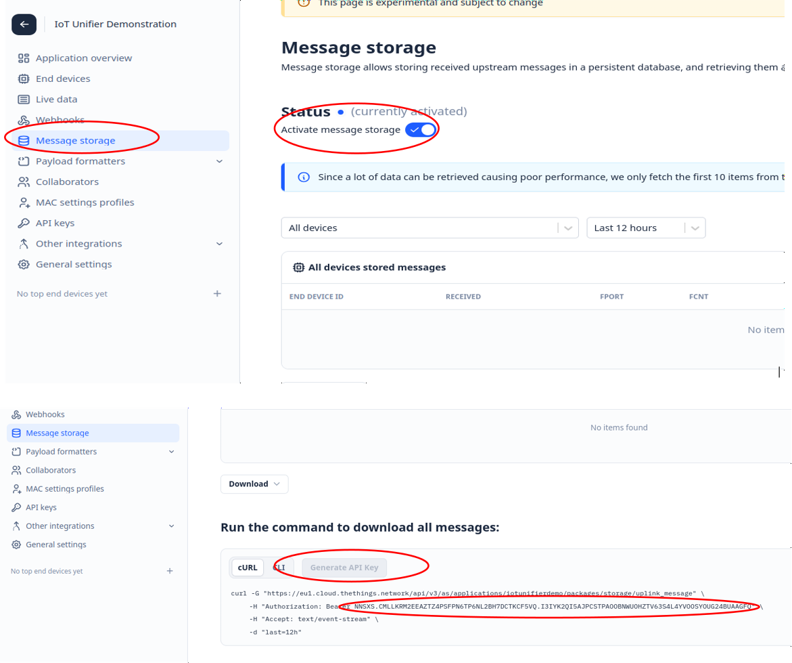

# iot_backend

This project creates an univeral IoT backend, which can collect data from different WAN networks (TTN, ChripStack, custom solutions, ...).
For now, the data is concentrated in a PostgreSQL database and made available for further usage with an unified REST API.

## Installation (tested on Xubuntu 24.04)

### Setup PostgreSQL

~~~
sudo apt install postgresql
sudo -i -u postgres psql
ALTER USER postgres WITH PASSWORD 'postgres';
\q
~~~

### Install the Python package

~~~
python3 -m venv ./venv
source ./venv/bin/activate
git clone git@github.com:wuehr1999/iot_backend.git
cd iot_backend
pip3 install .
~~~

## Applications

### iot_backend_user_api

This application provides the unified REST API for data processing on ```Port 5000```. The documentation is under the ```/docs``` endpoint (```localhost:5000/docs```).
~~~
source ./venv/bin/activate
iot_backend --help
Usage: iot_backend [OPTIONS]

Options:
  --host TEXT    Host IP address
  --dbhost TEXT  Database host IP address
  --help         Show this message and exit.
~~~

#### API endpoints

### iot_backend_ttn_storage

This application synchronizes the database to the TTN Application message storage.
The message storage has to be activated for the TTN application and an API key needs to be generated.

<p align="center">
   
</p>

# Roadmap

* [x] Docker enviroment
* [x] Define data formats for different sensor types
* [x] Support different sensor types
* [ ] Define the featureset for the REST API
* [ ] MQTT connection to TTN
* [ ] Support TTN webhooks
* [ ] Consider security aspects for deployment on webservers
