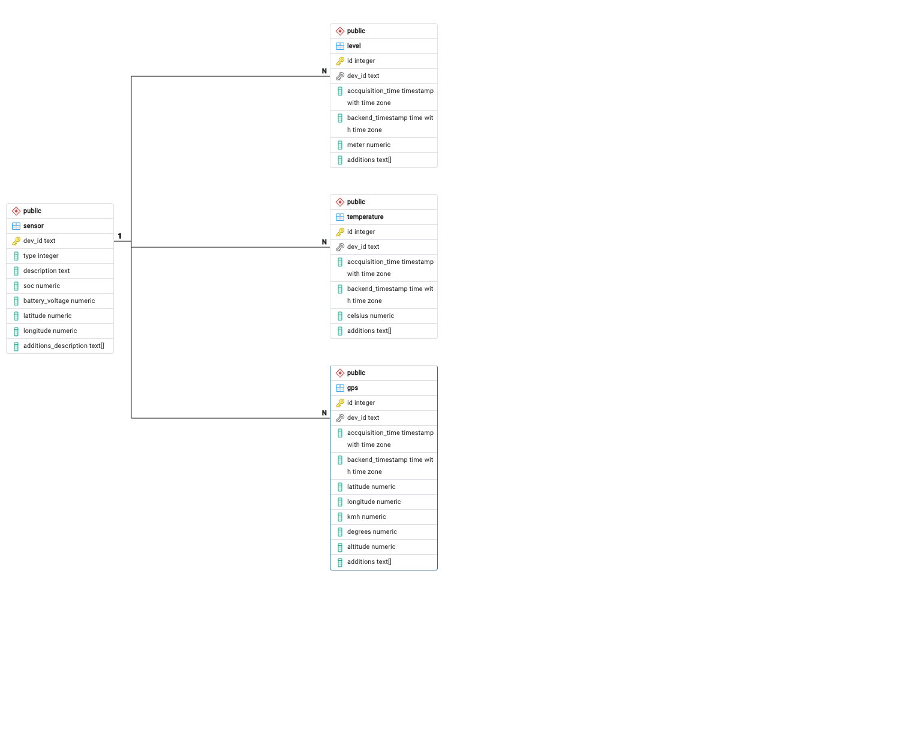

# Database Design Considerations



Tables containing the different payload data of the sensor systems are related to one table describing the sensor.

## Table sensor

- Description of the different sensor nodes
  
| Column | Type | Description |
| ------ | ---- | ----------- |
| ```dev_id``` | ```TEXT``` | Unique device ID of the sensor |
| ```type``` | ```INTEGER``` | Type of the sensor (For now ```0```=temperature, ```1```=gps, ```3```=level) |
| ```description``` | ```TEXT``` | User description of the sensor |
| ```soc``` | ```NUMERIC``` | State of charge from ```0 - 1``` |
| ```battery_voltage``` | ```NUMERIC``` | Current battery voltage |
| ```latitude``` | ```NUMERIC``` | Sensor position latitude |
| ```longitude``` | ```NUMERIC``` | Sensor position longitude |
| ```additions_description``` | ```TEXT[]``` | Description for additions |

## Sensor data tables

Key values of the specific application data (```temperature```, ```level```, ...) should have fixed columns to enable data harmonization of different sensors to defined value sets.
For user specific applications, an additions column is defined. For example, if a GPS receiver is used for wireless network coverage measurement, the addition field can hold some information about the signal quality.

### Table level

- Data from measuring heights, liquid levels, etc.

| Column | Type | Description |
| ------ | ---- | ----------- |
| ```id``` | ```INTEGER``` | Unique id of the measurement |
| ```dev_id``` | ```TEXT``` | Unique device ID of the sensor |
| ```accquisition_time``` | ```TIMESTAMP``` | Time of value accquisition within the sensor |
| ```backend_time``` | ```TIMESTAMP``` | Time of reception at the backend |
| ```meter``` | ```NUMERIC``` | Meter of level |
| ```additions``` | ```TEXT[]``` | Additional parameters and values |

### Table temperature 

- Data from measuring temperature

| Column | Type | Description |
| ------ | ---- | ----------- |
| ```id``` | ```INTEGER``` | Unique id of the measurement |
| ```dev_id``` | ```TEXT``` | Unique device ID of the sensor |
| ```accquisition_time``` | ```TIMESTAMP``` | Time of value accquisition within the sensor |
| ```backend_time``` | ```TIMESTAMP``` | Time of reception at the backend |
| ```celsius``` | ```NUMERIC``` | Temperature in celsius |
| ```additions``` | ```TEXT[]``` | Additional parameters and values |

### Table gps

- Data from GPS receivers

| Column | Type | Description |
| ------ | ---- | ----------- |
| ```id``` | ```INTEGER``` | Unique id of the measurement |
| ```dev_id``` | ```TEXT``` | Unique device ID of the sensor |
| ```accquisition_time``` | ```TIMESTAMP``` | Time of value accquisition within the sensor |
| ```backend_time``` | ```TIMESTAMP``` | Time of reception at the backend |
| ```latitude``` | ```NUMERIC``` | Latitude of the sensor |
| ```longitude``` | ```NUMERIC``` | Longitude of the sensor |
| ```kmh``` | ```NUMERIC``` | Speed of the sensor |
| ```degrees``` | ```NUMERIC``` | Heading to north of the sensor |
| ```altitude``` | ```NUMERIC``` | Altitude over sea level of the sensor |
| ```additions``` | ```TEXT[]``` | Additional parameters and values |
